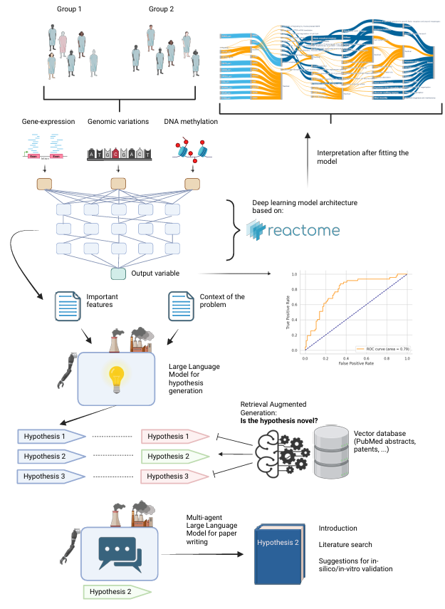

# Biologically informed deep learning for discovery of drug targets for PIK3CA mutated breast cancers

 
## 🚀 Introduction

Welcome to the official repository for the **BI-BRCA-Net-LLM**! This project introduces BI-BRCA-Net, a biologically informed, explainable deep learning methodology, to investigate the mechanistic differences between PIK3CA mutant and wild type breast cancer based on the recently published P-Net architecture [1]. By integrating multiomics data (including DNA copy number, gene expression levels, methylation, and gene mutations) through an explainable neural network architecture, BI-BRCA-Net leverages existing biological knowledge to validate functional interactions. It aims to identify and later to experimentally confirm the functional modules and pathways prevalent in PIK3CA mutant breast cancer [2]. The objective is to use Large Language Models (LLMs) to invent novel hypotheses on how to limit the growth of cancer cells by targeting identified pathways, validated through the suppression of critical pathway genes and evaluating their effects on cellular proliferation.


```diff
- Important note: The agentic LLM workflow is still prone to hallucinating. Always double-check the generated hypotheses for biological validity. Treat this solution as an interesting experiment.

```

## 📚 Overview

 


## 📚 Features

- **BI-BRCA-Net Introduction**: Presenting BI-BRCA-Net, a biologically informed, explainable deep learning methodology designed to explore the mechanistic differences between PIK3CA mutant and wild type breast cancer, building on the recently published P-Net architecture.

- **Multiomics Data Integration**: BI-BRCA-Net integrates various multiomics data types, including DNA copy number, gene expression levels, methylation, and gene mutations, through an explainable neural network architecture. This approach leverages existing biological knowledge to validate functional interactions.


- **Hypothesis Generation Using LLMs**: Utilizing Large Language Models (LLMs), BI-BRCA-Net generates novel hypotheses on limiting cancer cell growth by targeting identified pathways. These hypotheses are validated by suppressing critical pathway genes and evaluating their effects on cellular proliferation.

- **High-Quality Output**: Ensures the use of state-of-the-art language models to produce high relevance and quality of generated ideas, with in-vitro and in-silico validation recommendations.

- **User-Friendly Interface**: Features an easy-to-use interface for seamless hypothesis generation and validation, facilitating the process for researchers and clinicians (work in progress).


## 🌟 Demo

Check out our [live demo]() to see the app in action! Currently, the hypothesis generator part of the model is hosted here.

## 🛠️ Installation

To get started, clone this repository (a modified version of Pnet) and install the necessary dependencies:

```bash
git clone https://github.com/Paureel/BI-BRCA-NET
cd LLM-SCIGEN-BRCA
pip install -r requirements.txt
```


## 🚀 Usage

1. For the biologically informed deep learning part fit your model using one of the notebooks shown in the BI-BRCA-NET repository.

2. To generate scientific ideas, simply run the following command to launch the app:

```bash
streamlit run app.py
```


## 🧩 How It Works

The model is based on the Reflexion agentic workflow by Shinn et al. https://github.com/langchain-ai/langgraph/blob/main/examples/reflexion/reflexion.ipynb. By inputting a custom prompt, the model generates a series of potential ideas or research questions that could inspire your next scientific endeavor.

The final output is a csv file, with the following columns:

- **Hypotheses short description**: One sentence description of the hypothesis.
- **Generated Hypotheses**: Long description of the generated hypothesis.
- **Novelty**: 1-10 score on novelty.
- **What is not novel**: Description of what is not novel.
- **Missing**: What is missing from the description of the hypothesis.
- **Superfluous**: What is redundant in the description of the hypothesis.
- **Flag**: Is there anything unusual about the input?
- **References**: References from the literature.
- **Biohazard**: Is there anything dangerous in the generated hypothesis?
- **Relations to literature**: Description on how the hypothesis relates to the published papers in the field.

## 🧩 Sample results

### Claude Sonnet 3.5 - Pnet fitted on PIK3CA mutant breast cancer cases

| Hypotheses short description                                                                      | Generated Hypotheses                                                                                                                                                                                                                                                                                                                                                                                                                                                                                                                                                                                                                                                                                                                                                                                                                                                                                                                                                                                                                                                                                                                                                                                                                                                                                                                                                                                                                                                                                                                                                                                                                                                                                                                                                                                                                                                                                                                                                                                                                                                                                                                                                                                                                                                                                                                                                                                                                                                                                                                                                                                                                                                                 | Novelty | What is not novel                                                                                                                                                                                                                                                                                            | Missing                                                                                                                                                                                                                                                                                         | Superfluous                                                                                                                                 | Flag                                                                                                                                                                                                            | References                                                     | Relations to literature                                                                                                                                                                                                                                                                                                                                                                                                                                                                                                                                                                                                                                                                                                                                                                                                                                                                                                                                                                                                                                                                                                                                                                                                                                                                                                                                                                                                                                                                                                                                                                                                                                                                                                                                                                                                                                                                                                                                                                                                                                                                                                                                                                                                                                                                                                                                                                                                                                                                                                                                                                                                                                                                                                                                                                     |
| ------------------------------------------------------------------------------------------------- | ------------------------------------------------------------------------------------------------------------------------------------------------------------------------------------------------------------------------------------------------------------------------------------------------------------------------------------------------------------------------------------------------------------------------------------------------------------------------------------------------------------------------------------------------------------------------------------------------------------------------------------------------------------------------------------------------------------------------------------------------------------------------------------------------------------------------------------------------------------------------------------------------------------------------------------------------------------------------------------------------------------------------------------------------------------------------------------------------------------------------------------------------------------------------------------------------------------------------------------------------------------------------------------------------------------------------------------------------------------------------------------------------------------------------------------------------------------------------------------------------------------------------------------------------------------------------------------------------------------------------------------------------------------------------------------------------------------------------------------------------------------------------------------------------------------------------------------------------------------------------------------------------------------------------------------------------------------------------------------------------------------------------------------------------------------------------------------------------------------------------------------------------------------------------------------------------------------------------------------------------------------------------------------------------------------------------------------------------------------------------------------------------------------------------------------------------------------------------------------------------------------------------------------------------------------------------------------------------------------------------------------------------------------------------------------ | ------- | ------------------------------------------------------------------------------------------------------------------------------------------------------------------------------------------------------------------------------------------------------------------------------------------------------------ | ----------------------------------------------------------------------------------------------------------------------------------------------------------------------------------------------------------------------------------------------------------------------------------------------- | ------------------------------------------------------------------------------------------------------------------------------------------- | --------------------------------------------------------------------------------------------------------------------------------------------------------------------------------------------------------------- | -------------------------------------------------------------- | ------------------------------------------------------------------------------------------------------------------------------------------------------------------------------------------------------------------------------------------------------------------------------------------------------------------------------------------------------------------------------------------------------------------------------------------------------------------------------------------------------------------------------------------------------------------------------------------------------------------------------------------------------------------------------------------------------------------------------------------------------------------------------------------------------------------------------------------------------------------------------------------------------------------------------------------------------------------------------------------------------------------------------------------------------------------------------------------------------------------------------------------------------------------------------------------------------------------------------------------------------------------------------------------------------------------------------------------------------------------------------------------------------------------------------------------------------------------------------------------------------------------------------------------------------------------------------------------------------------------------------------------------------------------------------------------------------------------------------------------------------------------------------------------------------------------------------------------------------------------------------------------------------------------------------------------------------------------------------------------------------------------------------------------------------------------------------------------------------------------------------------------------------------------------------------------------------------------------------------------------------------------------------------------------------------------------------------------------------------------------------------------------------------------------------------------------------------------------------------------------------------------------------------------------------------------------------------------------------------------------------------------------------------------------------------------------------------------------------------------------------------------------------------------- |
| PSME4-SUMO1 axis as a therapeutic target in PIK3CA mutant breast cancer                           | Hypothesis Name: PSME4 and SUMO1 Interplay in PIK3CA Mutant Breast Cancer Progression<br><br>This hypothesis proposes a novel mechanism linking PIK3CA mutations in breast cancer to altered proteasome function through PSME4 (Proteasome Activator Subunit 4) and SUMO1 (Small Ubiquitin-like Modifier 1) interactions. In PIK3CA mutant breast cancer, we hypothesize that PSME4 overexpression, possibly induced by enhanced PI3K/AKT signaling, leads to increased proteasome activation [1]. Concurrently, SUMO1-mediated post-translational modifications may alter PSME4 function, affecting its proteasome-activating capabilities [2].<br><br>This PSME4-SUMO1 axis could contribute to cancer progression by modulating the degradation of tumor suppressors or cell cycle regulators. The involvement of CASP8 (caspase 8) suggests a potential impact on apoptotic pathways, while alterations in proteasome function may affect antigen processing and presentation, influencing immune responses in the tumor microenvironment [3].<br><br>Therapeutically, this hypothesis suggests targeting PSME4 or the SUMOylation process as potential treatments for PIK3CA mutant breast cancers. Inhibitors of PSME4 or SUMO-activating enzymes could be developed and tested in combination with PI3K/AKT pathway inhibitors for synergistic effects [4].<br><br>In-silico and in-vitro validation recommendations include analyzing TCGA breast cancer data to correlate PSME4 and SUMO1 expression with PIK3CA mutation status, performing proteomic studies to identify SUMOylation patterns of PSME4 in PIK3CA mutant cell lines, and assessing proteasome activity and immune responses in the presence of PSME4 or SUMOylation inhibitors.<br><br>This hypothesis is novel in its exploration of the PSME4-SUMO1 axis in PIK3CA mutant breast cancers, integrating proteasome regulation, post-translational modifications, and oncogenic signaling. The complexity lies in unraveling the intricate interplay between these cellular processes and their collective impact on cancer progression and immune responses, offering new perspectives for targeted therapies in breast cancer treatment.                                                                                                                                                                                                                                                                                                                                                                                                                                                                  | 8       | While the overall hypothesis is novel, the concept of targeting the proteasome in cancer is not entirely new, as proteasome inhibitors are already used in some cancer treatments. However, the specific mechanism proposed here focusing on PSME4 and SUMO1 in PIK3CA mutant breast cancer is indeed novel. | The hypothesis could benefit from more detailed exploration of the specific molecular mechanisms by which PIK3CA mutations lead to PSME4 overexpression. Additionally, the potential impact of this mechanism on other cancer hallmarks, such as metabolic reprogramming, could be discussed.   | The mention of TJP1 from the original context was removed as it was not central to the main hypothesis.                                     | The hypothesis appears to make sense and utilizes real gene names and features from the provided context. The generated hypothesis presents a plausible and novel mechanism that could be further investigated. | PMID: 26711497, PMID: 29339831, PMID: 31175138, PMID: 30833373 | Based on the provided research abstracts, I can summarize the key findings related to PI3K pathway inhibitors and breast cancer treatment:<br><br>1\. Alpelisib (PI3Kα inhibitor):<br><br>\- Approved for hormone receptor-positive, HER2-negative (HR+/HER2-) PIK3CA-mutated advanced breast cancer (ABC).<br>\- Initially approved based on efficacy for 11 specific PIK3CA mutations in exons 7, 9, and 20 (SOLAR1m).<br>\- New research shows benefit for patients with other pathogenic PIK3CA mutations (OTHERm) beyond the initial 11.<br>\- Comprehensive genomic profiling (CGP) detects PIK3CA mutations in 35% of tissue biopsies, with 7% having OTHERm only.<br>\- Patients with OTHERm also showed improved progression-free survival with alpelisib + fulvestrant compared to fulvestrant alone.<br><br>2\. PI3Kβ and AKT inhibitors:<br><br>\- Common resistance mechanism is reactivation of PI3K-AKT-mTOR signaling.<br>\- Deletion of TSC1/2 confers resistance through mTORC1 activation.<br>\- Deletion of PIK3R2 and INPPL1 drives specific PI3Kβ inhibitor resistance through AKT.<br>\- Deletion of PIK3CA, ERBB2, ERBB3 increases sensitivity to PI3Kβ inhibitors.<br>\- Combining PI3K/AKT inhibitors with Mcl-1 inhibitors may overcome resistance in both sensitive and resistant breast cancer cells.<br><br>3\. Endocrine therapy + CDK4/6 inhibition:<br><br>\- First-line treatment for HR+/HER2- metastatic breast cancer (MBC).<br>\- 30-40% of patients develop rapid disease progression.<br>\- Higher phosphorylation of CDK4/6 downstream substrates (Rb, FoxM1) associated with progressive disease.<br>\- Systemic PI3K/AKT/mTOR activation detected in patients with progressive disease.<br>\- Activation not fully explained by genomic alterations alone.<br><br>These findings highlight the importance of comprehensive genomic profiling in identifying patients who may benefit from PI3K pathway inhibitors, as well as the potential for combination therapies to overcome resistance mechanisms. The research also emphasizes the need for functional protein-based signaling analyses to predict treatment response and guide therapy selection in metastatic breast cancer patients.                                                                                                                                                                                                                                                                                                                                                                                                                                                                                                                                               |
| Dual targeting of CASP8 and FURIN to overcome apoptosis resistance in PIK3CA mutant breast cancer | Hypothesis Name: CASP8-FURIN Dual Targeting in PIK3CA Mutant Breast Cancer<br><br>This hypothesis proposes a novel therapeutic approach for PIK3CA mutant breast cancer by simultaneously targeting CASP8 and FURIN. In PIK3CA mutant breast cancer, we hypothesize a dysregulation between pro-apoptotic signaling (mediated by CASP8) and pro-survival signaling (partially regulated by FURIN-activated growth factors).<br><br>We propose that PIK3CA mutations may lead to increased FURIN activity, enhancing activation of growth factors and their receptors, which in turn suppresses CASP8-mediated apoptosis. Our dual-targeting strategy aims to:<br><br>1\. Enhance CASP8 activity to promote apoptosis in cancer cells.<br>2\. Inhibit FURIN to reduce growth factor activation, sensitizing cells to apoptotic signals.<br><br>This approach could potentially overcome pro-survival signaling induced by PIK3CA mutations and synergize with existing PI3K inhibitors. Recent studies have shown synergistic effects between apoptosis inducers and PI3K pathway inhibitors in breast cancer [1,2], supporting the potential of this strategy.<br><br>The combination of CASP8 activation and FURIN inhibition addresses both upstream (growth factor activation) and downstream (apoptosis evasion) effects of PIK3CA mutations. This multi-level intervention strategy demonstrates a sophisticated understanding of cancer cell signaling and drug resistance mechanisms, potentially opening new avenues for combination therapies in PIK3CA mutant breast cancer.<br><br>Validation recommendations include bioinformatic analysis of CASP8 and FURIN in PIK3CA mutant vs. wild-type breast cancers, in vitro studies assessing effects of CASP8 activation and FURIN inhibition, and in vivo studies using patient-derived xenografts to evaluate the proposed combination therapy.                                                                                                                                                                                                                                                                                                                                                                                                                                                                                                                                                                                                                                                                                                                                                                            | 7       | While the specific combination of CASP8 activation and FURIN inhibition in PIK3CA mutant breast cancer is novel, the concept of combining apoptosis inducers with PI3K pathway inhibitors has been explored in other contexts.                                                                               | The hypothesis could benefit from more specific examples of FURIN substrates relevant to breast cancer progression. It also lacks discussion on potential biomarkers for patient selection.                                                                                                     | The general description of the hypothesis structure could be condensed to focus more on the specific mechanisms and potential outcomes.     | The hypothesis is based on real gene names and pathways, and the reasoning is supported by recent research on synergistic effects in breast cancer treatment.                                                   | PMID: 36241868, PMID: 36641927                                 | Based on the provided research abstracts, here is a technical summary of key findings related to breast cancer treatments and resistance mechanisms:<br><br>1\. PI3K-AKT Pathway Inhibition and Resistance:<br><br>\- The PI3K pathway is commonly activated in breast cancer, and PI3K-AKT inhibitors are used clinically.<br>\- Resistance to PI3Kβ inhibitors (e.g. AZD8186) and AKT inhibitors (e.g. capivasertib) is primarily driven by reactivation of PI3K-AKT-mTOR signaling.<br>\- Specific gene deletions can confer resistance:<br>  - TSC1/2 deletion: Resistance to both PI3Kβ and AKT inhibitors through mTORC1 activation<br>  - PIK3R2 and INPPL1 deletion: Specific resistance to PI3Kβ inhibitors through AKT<br>\- Conversely, deletion of PIK3CA, ERBB2, ERBB3 increased sensitivity to PI3Kβ inhibitors.<br><br>2\. Overcoming Resistance:<br><br>\- Mcl-1 inhibition combined with PI3Kβ/AKT inhibition showed promise in overcoming resistance:<br>  - Enhanced apoptosis induction in both sensitive and resistant cells<br>  - Effective across breast cancer cell lines with PIK3CA and PTEN mutations<br>  - Increased anti-tumor benefit in vivo<br>\- mTOR inhibition was more effective than PI3K inhibition in overcoming resistance to hormone and CDK4/6 inhibitors:<br>  - Decreased cell proliferation, tumor growth, migration, and stemness<br>  - Effective regardless of PIK3CA mutation status<br><br>3\. Clinical Trials:<br><br>\- The phase III CAPItello-291 study showed that combining fulvestrant (an estrogen receptor antagonist) with capivasertib (an AKT inhibitor) more than doubled progression-free survival compared to fulvestrant alone in hormone receptor-positive, HER2-negative breast cancer patients resistant to aromatase inhibitors and CDK4/6 inhibitors.<br><br>4\. Alternative Approaches:<br><br>\- Smac mimetics (e.g. LCL-161) combined with TRAIL (TNF-related apoptosis-inducing ligand) showed potential in inducing apoptosis in some breast cancer cell lines:<br>  - Efficacy dependent on caspase-8 activation and RIP1 (receptor-interacting protein 1) involvement<br>  - c-FLIP (cellular FLICE-like inhibitory protein) depletion enhanced the effect in some cell lines<br><br>These findings highlight the complexity of resistance mechanisms in breast cancer and suggest potential strategies for overcoming resistance, including combination therapies targeting multiple pathways and the use of novel compounds like Mcl-1 inhibitors and Smac mimetics.                                                                                                                                                                                                                                 |
| MBTPS1 modulation enhances ER stress in PIK3CA mutant breast cancer                               | Hypothesis Name: MBTPS1-Mediated ER Stress Modulation in PIK3CA Mutant Breast Cancer<br><br>Long Description and Reasoning:<br>This hypothesis proposes that MBTPS1 (Membrane Bound Transcription Factor Peptidase, Site 1) plays a crucial role in modulating endoplasmic reticulum (ER) stress response in PIK3CA mutant breast cancer, potentially offering a novel therapeutic target. MBTPS1, identified as an important feature in the statistical model, is key in activating membrane-bound transcription factors involved in the unfolded protein response (UPR) and ER stress response [1].<br><br>PIK3CA mutations are known to increase cellular stress, potentially making these cancer cells more dependent on stress response mechanisms [2]. We hypothesize that in PIK3CA mutant breast cancer, MBTPS1 activity is upregulated to help cancer cells cope with increased ER stress. This upregulation could be promoting cancer cell survival by fine-tuning the ER stress response.<br><br>Targeting MBTPS1 could push PIK3CA mutant breast cancer cells over the edge into terminal UPR and cell death. This approach could be particularly effective when combined with PI3K inhibitors like alpelisib, which are known to induce ER stress [3]. The strategy aligns with recent findings that prolonged inhibition of other pathways (e.g., HER2) can lead to proteotoxic ER stress, creating vulnerabilities in cancer cells [4].<br><br>In-Silico and In-Vitro Validation Recommendations:<br>1\. Bioinformatic analysis of MBTPS1 expression in PIK3CA mutant vs. wild-type breast cancer datasets.<br>2\. CRISPR-Cas9 knockout or siRNA knockdown of MBTPS1 in PIK3CA mutant and wild-type breast cancer cell lines to assess its effect on cell viability and ER stress markers.<br>3\. High-throughput drug screening to identify compounds that inhibit MBTPS1 activity.<br>4\. Combination studies with PI3K inhibitors (e.g., alpelisib) and identified MBTPS1 inhibitors in PIK3CA mutant breast cancer models.<br>5\. Analysis of ER stress markers and UPR activation in response to MBTPS1 inhibition and PI3K inhibition, both alone and in combination.<br><br>Novelty and Complexity:<br>This hypothesis is novel as it focuses specifically on MBTPS1's role in PIK3CA mutant breast cancer, an unexplored area. It bridges the gap between PIK3CA mutations and ER stress response pathways, suggesting a complex interplay that could be unique to these cancers. The complexity lies in understanding how MBTPS1 modulation could synergize with existing PI3K inhibitors to overcome resistance mechanisms in PIK3CA mutant breast cancers. | 8       | While targeting ER stress in cancer is not a new concept, the specific focus on MBTPS1 in PIK3CA mutant breast cancer provides a novel angle.                                                                                                                                                                | The hypothesis could benefit from more specific details on the downstream effectors of MBTPS1 in the context of ER stress response. Additionally, it lacks discussion on potential biomarkers that could predict responsiveness to MBTPS1-targeted therapies.                                   | The in-vitro validation recommendations are comprehensive but could be more focused on the specific role of MBTPS1 in ER stress response.   | The hypothesis is based on real gene names and features from the provided model output, making it a plausible avenue for investigation.                                                                         | PMID: 28445112, PMID: 31015298, PMID: 36480552                 | Based on the provided research abstracts, here is a technical summary of the key findings related to breast cancer treatment mechanisms and potential new therapeutic approaches:<br><br>1\. PI3K-AKT-mTOR Pathway Inhibition:<br><br>\- The PI3K-AKT-mTOR signaling pathway is frequently activated in breast cancer and is a target for inhibitors.<br>\- Resistance to PI3Kβ and AKT inhibitors primarily occurs through reactivation of PI3K-AKT-mTOR signaling.<br>\- Deletion of TSC1/2 confers resistance through mTORC1, while deletion of PIK3R2 and INPPL1 drives resistance through AKT.<br>\- Combining Mcl-1 inhibitors with PI3Kβ/AKT inhibitors shows promise in overcoming resistance and enhancing anti-tumor effects.<br><br>2\. Endocrine Therapy and CDK4/6 Inhibition:<br><br>\- Combination of endocrine therapy and CDK4/6 inhibition is a first-line treatment for HR+/HER2- metastatic breast cancer.<br>\- Phosphorylation levels of CDK4/6 substrates Rb and FoxM1 are higher in patients with progressive disease.<br>\- PI3K/AKT/mTOR activation in tumor epithelia and stroma/immune cells is associated with disease progression.<br>\- Protein-based signaling analyses may improve response prediction and treatment selection.<br><br>3\. Mitochondrial Translation and PI3K Mutations:<br><br>\- PIK3CA gain-of-function and CBFB loss-of-function mutations cooperate to promote breast tumor progression.<br>\- CBFB plays a role in mitochondrial genome translation by enhancing mRNA binding to TUFM.<br>\- CBFB deficiency leads to metabolic reprogramming, including defective oxidative phosphorylation and autophagy/mitophagy addiction.<br>\- Combining autophagy and PI3K inhibitors shows promise for treating breast cancers with CBFB and PIK3CA mutations.<br><br>4\. UBA1 as a Target in Triple-Negative Breast Cancer (TNBC):<br><br>\- Genome-wide CRISPR/Cas9 screening identified ubiquitin-like modifier activating enzyme 1 (UBA1) as a potential target in TNBC.<br>\- The UBA1 inhibitor TAK-243 induces ER stress and ATF4-mediated upregulation of proapoptotic NOXA.<br>\- c-MYC expression correlates with TAK-243 sensitivity and cooperates to induce cell death.<br>\- TAK-243 shows promise in patient-derived xenograft models and reduces metastatic burden in TNBC.<br><br>These findings highlight the complexity of breast cancer treatment resistance mechanisms and suggest several potential new therapeutic strategies, including combination therapies targeting PI3K-AKT-mTOR signaling, mitochondrial translation, autophagy, and UBA1 inhibition. Further research and clinical trials are needed to validate these approaches and determine their efficacy in treating various breast cancer subtypes. |
| NAPEPLD-TJP1 axis as a therapeutic target in PIK3CA mutant breast cancer                          | Hypothesis Name: NAPEPLD-TJP1 Axis in Lipid Metabolism Dysregulation as a Therapeutic Target for PIK3CA Mutant Breast Cancer<br><br>Long Description and Reasoning:<br>This hypothesis proposes that PIK3CA mutations in breast cancer lead to dysregulation of lipid metabolism through the interplay between NAPEPLD and TJP1, creating a unique vulnerability for therapeutic exploitation. PIK3CA mutations, common in breast cancer, lead to aberrant activation of the PI3K/AKT/mTOR pathway, which is involved in cell growth, proliferation, and metabolism [1]. We hypothesize that this activation affects the expression or activity of NAPEPLD and TJP1, both showing copy number alterations in the model.<br><br>NAPEPLD, key in endocannabinoid biosynthesis, may alter lipid signaling and metabolism when dysregulated. TJP1, typically associated with tight junctions, could affect cell-cell adhesion and signaling pathways. The combined effect may lead to:<br><br>1\. Altered endocannabinoid signaling affecting lipid metabolism and cell proliferation.<br>2\. Disrupted tight junction integrity contributing to increased invasiveness.<br>3\. Metabolic reprogramming providing a growth advantage to PIK3CA mutant cells.<br><br>This axis could be therapeutically targeted by:<br>a) Developing NAPEPLD inhibitors to modulate endocannabinoid levels.<br>b) Using TJP1 modulators to affect tight junction integrity and signaling.<br>c) Combining these approaches with PI3K inhibitors like alpelisib for a synergistic effect [2].<br><br>In-silico and in-vitro validation recommendations include bioinformatics analysis, gene expression profiling, metabolomics studies, CRISPR/Cas9 gene editing, drug sensitivity assays, and animal studies to evaluate the efficacy of targeting the NAPEPLD-TJP1 axis in PIK3CA mutant breast tumors.<br><br>Novelty and Complexity:<br>This hypothesis is novel as it connects PIK3CA mutations to lipid metabolism dysregulation through the unexplored NAPEPLD-TJP1 axis in breast cancer. It integrates oncogenic signaling, lipid metabolism, and cell adhesion, providing a multifaceted view of cancer biology. The approach combines targeting metabolic enzymes with structural proteins, offering a fresh perspective on PIK3CA mutant breast cancer treatment.                                                                                                                                                                                                                                                                                                                            | 8       | While the NAPEPLD-TJP1 axis is novel, the general concept of targeting metabolism in cancer is not new. However, the specific combination proposed here is unique.                                                                                                                                           | The revised hypothesis still lacks specific molecular mechanisms linking PIK3CA mutations to NAPEPLD and TJP1 alterations. It could benefit from more detailed explanations of potential signaling pathways involved.                                                                           | The in-vitro validation recommendations have been condensed, but could be further prioritized to focus on the most crucial experiments.     | The hypothesis remains plausible and based on real gene names and features from the model output.                                                                                                               | PMID: 26953420, PMID: 31015206                                 | Based on the provided research abstracts, I can summarize the key points about PIK3CA mutations and alpelisib treatment in breast cancer:<br><br>1\. PIK3CA Mutations in Breast Cancer:<br><br>\- PIK3CA mutations are common in breast cancer, particularly in hormone receptor-positive (HR+) and HER2-negative (HER2-) subtypes.<br>\- These mutations can occur in "hotspot" regions (exons 7, 9, and 20) as well as in non-hotspot regions.<br>\- Approximately 35% of breast cancer tissue biopsies show PIK3CA mutations.<br>\- About 20% of PIK3CA mutations occur in non-hotspot regions.<br><br>2\. Alpelisib Treatment:<br><br>\- Alpelisib is a PI3Kα-selective inhibitor approved for treating HR+/HER2- PIK3CA-mutated advanced breast cancer.<br>\- It was initially approved based on the SOLAR-1 trial, which focused on 11 specific PIK3CA mutations.<br>\- Recent studies show that alpelisib may also benefit patients with non-hotspot PIK3CA mutations.<br><br>3\. Clinical Efficacy:<br><br>\- In HR+/HER2- advanced breast cancer with PIK3CA mutations, alpelisib plus fulvestrant showed improved progression-free survival compared to fulvestrant alone (5.9 months vs. 3.1 months).<br>\- Patients with non-hotspot PIK3CA mutations also showed benefit from alpelisib (4.0 months vs. 2.5 months progression-free survival).<br><br>4\. Detection Methods:<br><br>\- Comprehensive genomic profiling (CGP) can detect a wider range of PIK3CA mutations compared to PCR hotspot testing.<br>\- Liquid biopsy has shown 77% sensitivity in detecting PIK3CA mutations, increasing to 95% with ctDNA fraction ≥2%.<br><br>5\. Potential for Prevention:<br><br>\- Preclinical studies suggest that short-term PI3K inhibition with alpelisib may prevent breast cancer development in high-risk individuals.<br>\- Alpelisib has shown promise in slowing early lesion expansion and preventing cancer formation in mouse models.<br><br>6\. Considerations for HER2+ Breast Cancer:<br><br>\- In HER2-positive breast cancer, PIK3CA mutations are associated with lower pathologic complete response rates to neoadjuvant therapy with pyrotinib and trastuzumab plus chemotherapy.<br><br>These findings highlight the importance of comprehensive genetic testing for PIK3CA mutations in breast cancer patients and suggest that alpelisib may have broader applications in treatment and potentially prevention strategies for breast cancer.                                                                                                                                                                                                                                                                                                         |
| POMT2-NPC1L1 axis in lipid metabolism dysregulation of PIK3CA mutant breast cancer                | Hypothesis Name: POMT2-NPC1L1 Axis in Lipid Metabolism Dysregulation of PIK3CA Mutant Breast Cancer<br><br>This hypothesis proposes a novel interplay between POMT2-mediated O-mannosylation and NPC1L1-dependent lipid metabolism in PIK3CA mutant breast cancer. PIK3CA mutations may alter POMT2 activity, leading to aberrant O-mannosylation of NPC1L1, a key cholesterol transporter. This post-translational modification could affect NPC1L1's stability, localization, or function, disrupting cellular lipid homeostasis [1].<br><br>The presence of both POMT2_cna and NPC1L1_cna as significant features in the model, along with pathways related to lipid metabolism, supports this hypothesis. Altered lipid metabolism is a hallmark of cancer, and PIK3CA mutations are known to rewire metabolic pathways [2]. The dysregulation of O-mannosylation and subsequent impact on NPC1L1 function could contribute to the metabolic adaptations that support the growth and survival of PIK3CA mutant breast cancer cells.<br><br>Therapeutically, this hypothesis suggests a dual-targeting approach: inhibiting POMT2 to disrupt aberrant O-mannosylation, while simultaneously modulating NPC1L1 activity. This could potentially synergistically target PIK3CA mutant breast cancers [3].<br><br>In-silico and in-vitro validation recommendations:<br>1\. Analyze correlation between POMT2 and NPC1L1 expression/copy number alterations in PIK3CA mutant breast cancer datasets.<br>2\. Perform glycoproteomics to identify O-mannosylation sites on NPC1L1 in PIK3CA mutant vs. wild-type breast cancer cells.<br>3\. Assess the impact of POMT2 knockdown/inhibition on NPC1L1 function and lipid metabolism in breast cancer cell lines.<br>4\. Evaluate the efficacy of combined POMT2 and NPC1L1 inhibition in PIK3CA mutant breast cancer models.<br><br>This hypothesis uniquely connects PIK3CA mutations, O-mannosylation, and lipid metabolism through the POMT2-NPC1L1 axis, offering a new perspective on metabolic rewiring in breast cancer.                                                                                                                                                                                                                                                                                                                                                                                                                                                                                                                                                                                                       | 8       | The concept of targeting metabolic pathways in cancer is not entirely new, but the specific POMT2-NPC1L1 axis in PIK3CA mutant breast cancer appears novel.                                                                                                                                                  | The hypothesis could benefit from more detailed discussion of potential feedback mechanisms between lipid metabolism and PI3K signaling. Additionally, it lacks consideration of how this axis might interact with other significant features identified in the model, such as CASP8 and FURIN. | The mention of specific inhibitors or drugs might be premature without more direct evidence linking this axis to breast cancer progression. | The hypothesis is based on real gene names and pathways identified in the model, and the reasoning appears sound given the provided features.                                                                   | PMID: 31265449, PMID: 26590714, PMID: 29347467                 | Based on the provided research abstracts, I can summarize the key findings related to PIK3CA mutations in breast cancer:<br><br>1\. Prevalence and Association with Tumor Characteristics:<br>\- PIK3CA mutations are common in breast cancer, with a mutation rate of 26.7% observed in one large cohort study.<br>\- These mutations are more frequent in:<br>  - Steroid hormone receptor (SHR)-positive, HER2-negative tumors (31.4%)<br>  - Grade 1 and Grade 2 tumors (32.8%)<br><br>2\. Impact on Prognosis and Treatment Response:<br>\- The impact of PIK3CA mutations on recurrence-free interval (RFI) and overall survival (OS) is heterogeneous.<br>\- In SHR-positive breast cancers:<br>  - There's a trend towards impaired RFI in patients with PIK3CA mutations.<br>  - A significantly detrimental prognostic impact was observed in SHR-positive, HER2-negative breast cancers treated with aromatase inhibitors alone.<br>\- In SHR-negative breast cancers:<br>  - PIK3CA mutations were insignificantly associated with improved RFI.<br><br>3\. Response to HER2-Targeted Therapy:<br>\- In HER2-positive breast cancers, PIK3CA mutations are associated with a lower pathologic complete response (pCR) rate to neoadjuvant therapy with pyrotinib and trastuzumab plus chemotherapy.<br>\- Patients with wild-type PIK3CA had a significantly higher pCR rate compared to those with mutated PIK3CA (80.8% vs. 26.3%).<br><br>4\. Molecular Mechanisms and Therapeutic Implications:<br>\- PIK3CA oncogenic gain-of-function (GOF) mutations can cooperate with CBFB loss-of-function (LOF) mutations to promote breast tumor progression.<br>\- This cooperation leads to dysregulation of mitochondrial translation and metabolic reprogramming, including:<br>  - Defective oxidative phosphorylation (OXPHOS)<br>  - The Warburg effect<br>  - Autophagy-mitophagy addiction<br>\- The study suggests a potential for combining autophagy and PI3K inhibitors as a precision medicine approach for breast cancers with these mutation profiles.<br><br>5\. Treatment Considerations:<br>\- Estrogen deprivation therapy (aromatase inhibitors) may be less effective in cases with PIK3CA mutations.<br>\- The findings provide a rationale for developing new combination therapies and personalized treatment strategies based on PIK3CA mutation status.<br><br>These findings highlight the importance of PIK3CA mutations in breast cancer biology, prognosis, and treatment response. They also suggest potential avenues for targeted therapies and combination approaches in precision medicine for breast cancer patients.                                                                                                                          |

## 🤝 Contributing

Contributions are welcome! If you'd like to contribute to this project, please fork the repository and create a pull request. For major changes, please open an issue first to discuss what you would like to change.

1. Fork the Project
2. Create your Feature Branch (`git checkout -b feature/AmazingFeature`)
3. Commit your Changes (`git commit -m 'Add some AmazingFeature'`)
4. Push to the Branch (`git push origin feature/AmazingFeature`)
5. Open a Pull Request

## 📜 License

Distributed under the MIT License. See `LICENSE` for more information.

## 🙌 Acknowledgements

This project was conceived during Breast cancer genomics hackathon event 
organized by the Susan G Komen for the Cure and University of Texas Southwestern in 
2023 and currently supported by Susan G Komen for the Cure (OG241196018


## 🌐 Connect with Us

- [GitHub Issues](https://github.com/Paureel/scientific-idea-generator/issues)
- [Discussions](https://github.com/Paureel/scientific-idea-generator/discussions)
- [Twitter/X](https://x.com/aurel_pr)
- [LLM-SCI-GEN](https://github.com/Paureel/LLM-SCI-GEN) Papers about scientific hypothesis generation with large language models (LLMs), maintained by me. Check it out if you are interested in this topic.

## 📜 References

[1] Elmarakeby, Haitham A et al. “Biologically informed deep neural network for prostate cancer discovery.” Nature vol. 598,7880 (2021): 348-352. doi:10.1038/s41586-021-03922-4
[2] Reinhardt K et al. "PIK3CA-mutations in breast cancer. Breast Cancer" Res Treat. 2022 Dec;196(3):483-493. doi: 10.1007/s10549-022-06637-w. PMID: 36279023
[3] Börcsök, Judit et al. “Identification of a Synthetic Lethal Relationship between Nucleotide  Excision Repair Deficiency and Irofulven Sensitivity in Urothelial Cancer.” Clinical cancer research vol. 27,7 (2021): 2011-2022. doi:10.1158/1078-0432.CCR-20-3316